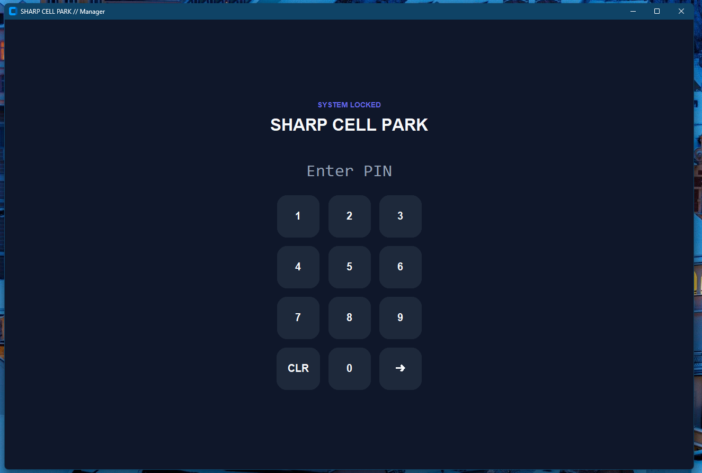
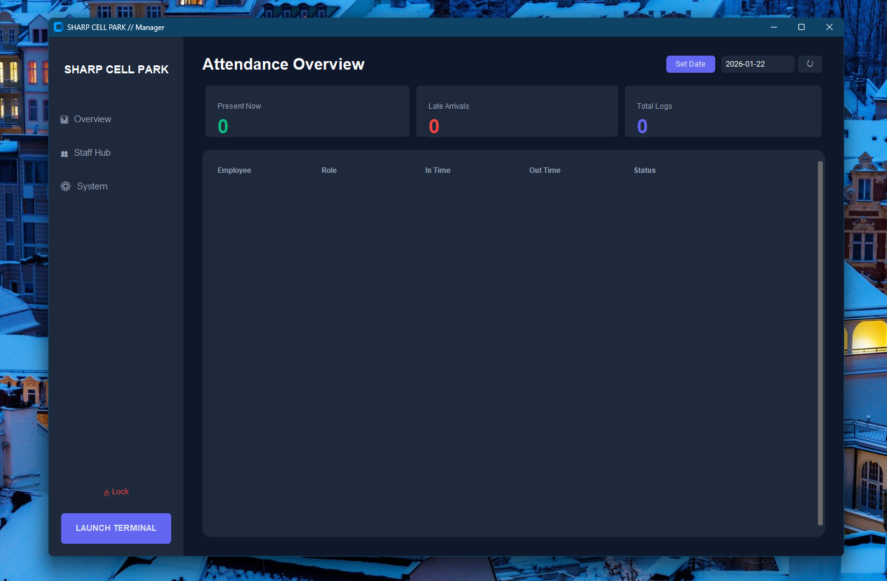
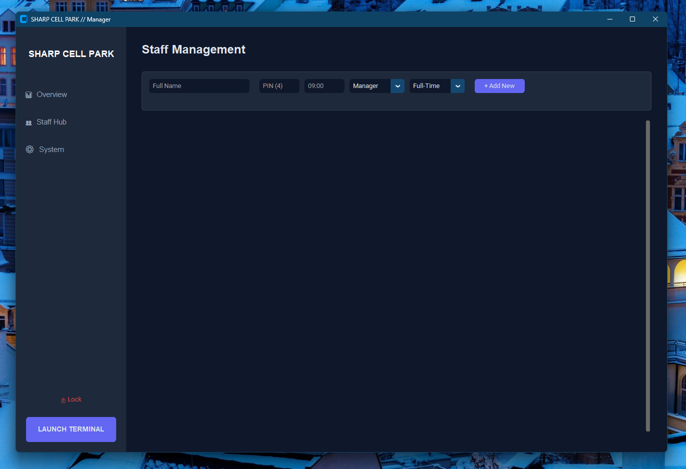
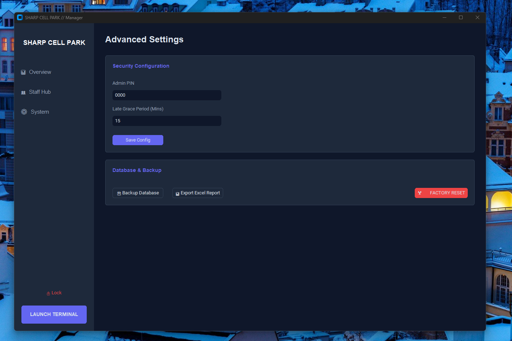
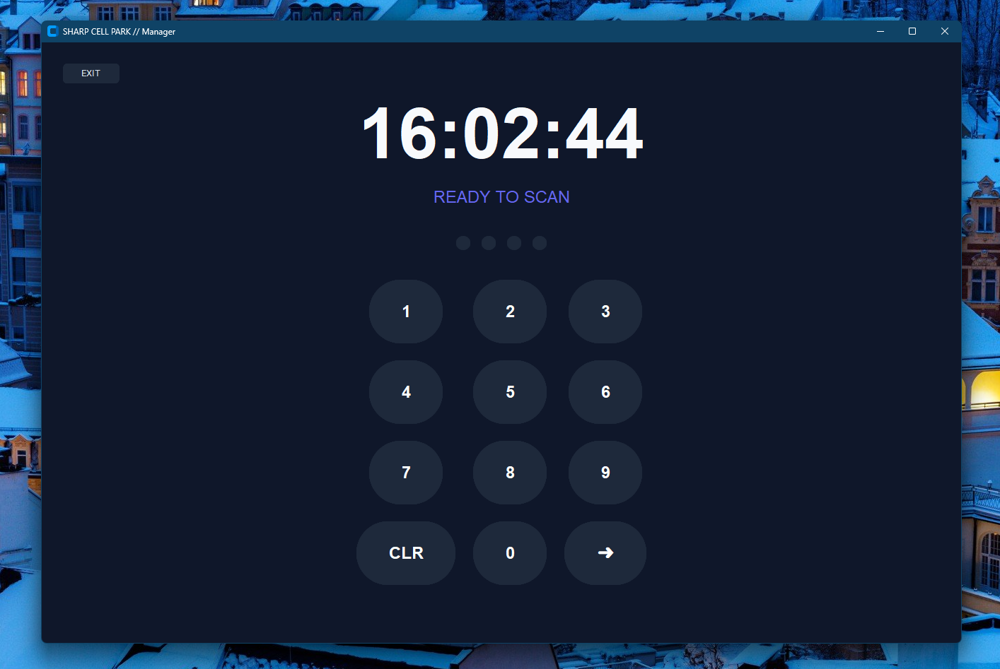

**Smart Attendance System** is a robust desktop application designed to replace paper logs and complex enterprise software. Built with **Python** and **CustomTkinter**, it offers a premium dark-mode interface that manages staff clock-ins, calculates late arrivals automatically, and keeps your data secure locally.

It features a **Dual-Mode Architecture**:
1.  **Admin Dashboard:** For owners to manage staff, view logs, and export data.
2.  **Terminal Mode:** A distraction-free, full-screen interface for staff to clock in using PINs.

---

## 📸 Interface Gallery

<table style="width:100%">
  <tr>
    <th width="50%">1. Secure Admin Entry</th>
    <th width="50%">2. Attendance Overview</th>
  </tr>
  <tr>
    <td></td>
    <td></td>
  </tr>
  <tr>
    <th width="50%">3. Staff Hub (Management)</th>
    <th width="50%">4. Advanced System Settings</th>
  </tr>
  <tr>
    <td></td>
    <td></td>
  </tr>
</table>

<p align="center">
  <b>5. Shop Floor Terminal (Staff View)</b><br>
  
</p>

---


## ✨ Key Features

### 🛡️ Admin & Management
* **Dynamic Branding:** Change your Shop Name and Admin PIN instantly in settings.
* **Staff Hub:** Add, edit, or remove employees with specific shift start times.
* **Smart Logic:** The system automatically flags entries as `LATE` based on a configurable grace period.

### 📊 Data & Security
* **Zero-Setup Database:** Uses SQLite. No server installation required.
* **Excel Export:** Download monthly attendance reports with one click.
* **Privacy:** All data is stored locally on your machine.
* **Backups:** Built-in tool to create manual database backups.

---

## 🚀 Getting Started

### Option A: For Users (No Coding Required)
If you just want to run the app on your Windows PC:

1.  Go to the [**Releases Page**](https://github.com/AA1-31-Murshid/Smart-Attendance-System/releases).
2.  Download the latest `attendance_app.exe` file.
3.  Double-click to run!
    > **Note:** On the first run, Windows might ask for permission. Click "More Info" -> "Run Anyway".

### Option B: For Developers (Source Code)
To run the source code or contribute:

1.  **Clone the repository**
    ```bash
    git clone [https://github.com/AA1-31-Murshid/Smart-Attendance-System.git](https://github.com/AA1-31-Murshid/Smart-Attendance-System.git)
    cd Smart-Attendance-System
    ```

2.  **Install Dependencies**
    ```bash
    pip install -r requirements.txt
    ```

3.  **Run the App**
    ```bash
    python attendance_app.py
    ```

---

## ⚙️ Configuration
On the first launch, use the default credentials to unlock the system:

| Setting | Default Value | Action Required |
| :--- | :--- | :--- |
| **Admin PIN** | `0000` | 🔴 **Change Immediately** |
| **Grace Period** | `15 Minutes` | 🟡 Adjust as needed |

> ⚠️ **Important:** Go to the **Settings** tab immediately to change the Admin PIN to something secure.

---

## 🛠️ Tech Stack

| Component | Technology | Description |
| :--- | :--- | :--- |
| **Core** | Python 3.10+ | Main programming language |
| **UI Framework** | CustomTkinter | Modern, high-DPI aware GUI |
| **Database** | SQLite3 | Local, serverless storage |
| **Data Engine** | Pandas | Excel export and data handling |

---

## 📂 Project Structure

```text
📁 Smart-Attendance-System/
├── 📄 attendance_app.py      # Main Application Source Code
├── 📄 requirements.txt       # Python Dependencies
├── 📄 .gitignore             # Git Configuration
├── 📄 LICENSE                # MIT License
└── 📄 README.md              # Project Documentation
